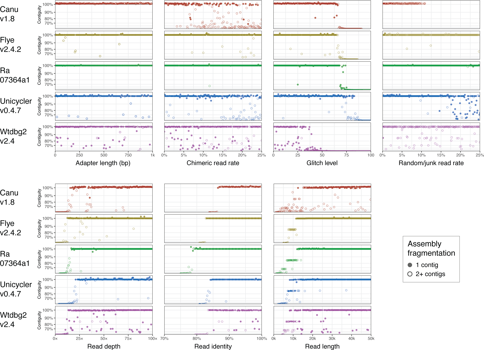
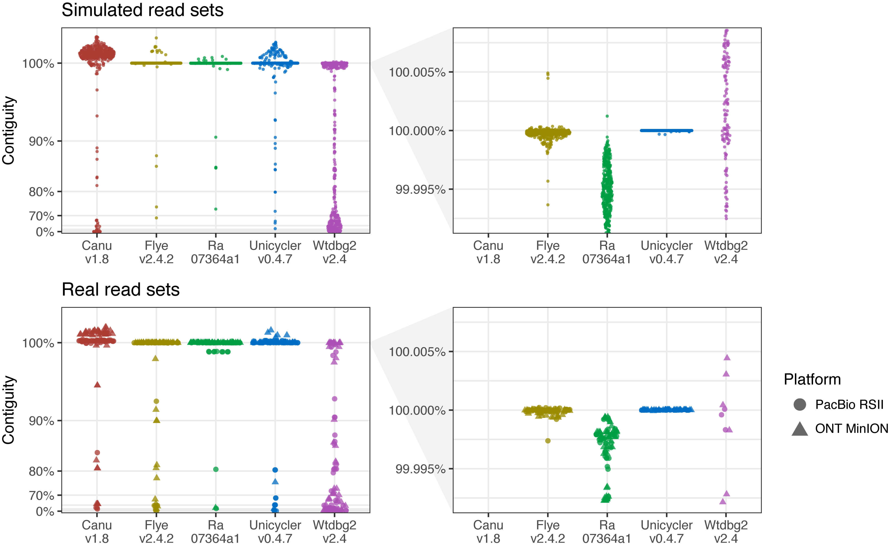
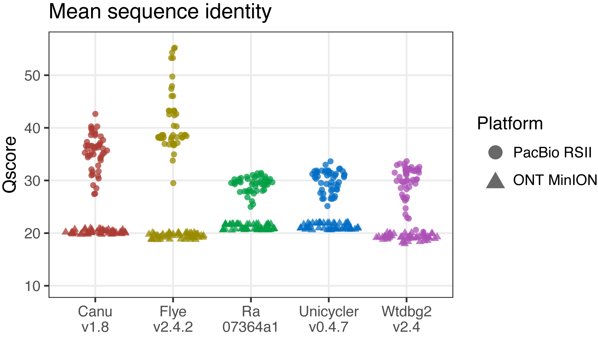
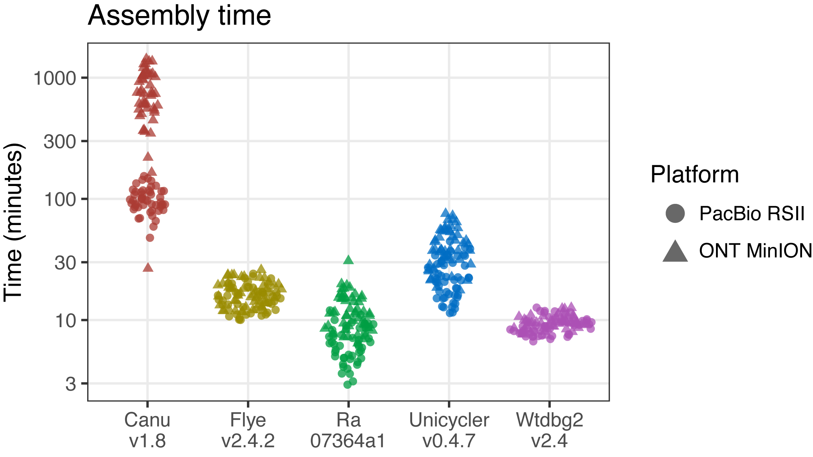
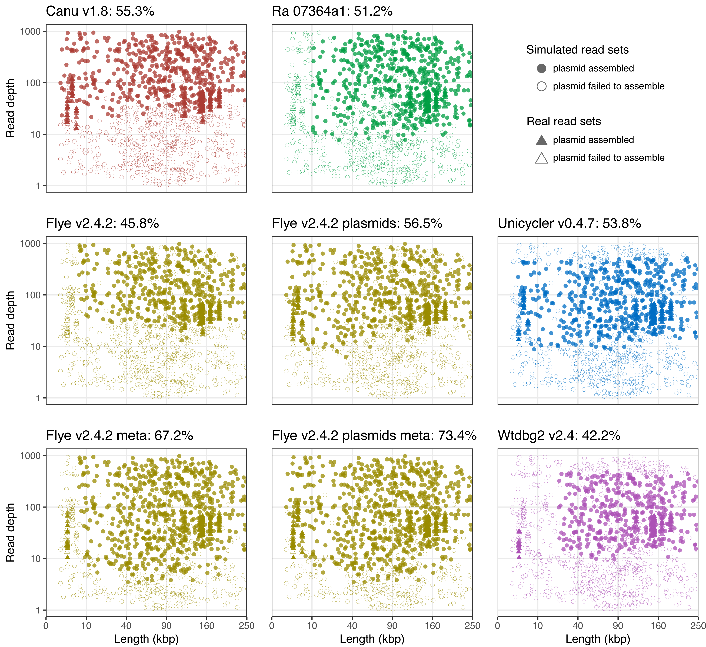

# Benchmarking of long-read assembly tools for bacterial whole genomes

__Ryan R. Wick<sup>1</sup> and Kathryn E. Holt<sup>1,2</sup>__
<br>
<sub>1. Department of Infectious Diseases, Central Clinical School, Monash University, Melbourne, Victoria 3004, Australia<br>2. London School of Hygiene & Tropical Medicine, London WC1E 7HT, UK</sub>

[](https://doi.org/10.5281/zenodo.2702443)


This repo contains early results for our benchmarking of long-read assemblers for bacterial genomes. It is still a work in progress, and we'll be putting together a manuscript in the future. But until then, we decided to show our results here on GitHub for the eager and/or curious!

Still interested? Read on! Or if you're feeling impatient, skip to the [results](#results-and-discussion) or [conclusions](#conclusions).


## Table of contents

* [Introduction](#introduction)
* [Methods](#methods)
   * [Assemblers and commands](#assemblers-and-commands)
   * [Simulated read sets](#simulated-read-sets)
   * [Real read sets](#real-read-sets)
   * [Assessing chromosome contiguity](#assessing-chromosome-contiguity)
   * [Assessing plasmid assembly](#assessing-plasmid-assembly)
* [Results and discussion](#results-and-discussion)
   * [Robustness](#robustness)
   * [Reliability](#reliability)
   * [Sequence identity](#sequence-identity)
   * [Speed performance](#speed-performance)
   * [Plasmids](#plasmids)
* [Conclusions](#conclusions)
* [References](#references)
* [License](#license)


## Introduction

We had two primary aims for this study:

1. To explore how different features of a read set affect assemblers. I.e. what does and does not matter about your reads for the purposes of assembly?
2. To compare the performance of long-read assemblers for bacterial genomes and make recommendations for users.

We investigated aim 1 using simulated read sets from [Badread](https://github.com/rrwick/Badread), which gives a lot of control over many read parameters. For aim 2, we used both simulated read sets (again from Badread) and real read sets (both ONT and PacBio).

We approached this study with the following attitude: long read assembly of a bacterial genome should be a solved problem, at least from a large-scale structural perspective. A successful long-read assembly is complete (one contig per replicon) and without any structural errors – anything else counts as a failure. However, small-scale errors (substitutions and indels) are currently inevitable in long-read assemblies, i.e. consensus sequence accuracy is less than 100%. While consensus accuracy is interesting and does briefly feature in our results, it wasn't a major focus for this study. That's because long-read assemblies should probably be polished with a platform-specific tool like [Arrow](https://github.com/PacificBiosciences/GenomicConsensus) or [Nanopolish](https://github.com/jts/nanopolish) anyway. Since sequence identity is something that can (and should) be fixed up in a separate post-assembly step, an assembler's consensus error rate doesn't matter too much.


Finally, I should also point out some things that this study does _not_ do:

* It doesn't address where Illumina reads fit into the picture. E.g. is it better to do a hybrid assembly with a tool like [Unicycler](https://github.com/rrwick/Unicycler) or to do a long-read-only assembly and then polish with a tool like [Pilon](https://github.com/broadinstitute/pilon)? This is a great question which deserves attention, but here we studied assembly of long reads only.
* It doesn't investigate how assemblers perform on viruses, eukaryotes, metagenomes or anything else that isn't a bacterial genome.


## Methods

### Assemblers and commands

We tested the current version (as of the time of writing) of five different assemblers: [Canu](https://github.com/marbl/canu), [Flye](https://github.com/fenderglass/Flye), [Ra](https://github.com/rvaser/ra), [Unicycler](https://github.com/rrwick/Unicycler) and [Wtdbg2](https://github.com/ruanjue/wtdbg2).

Assemblers that only work on PacBio reads (i.e. not on Oxford Nanopore reads) were excluded, such as [HGAP](https://github.com/PacificBiosciences/Bioinformatics-Training/wiki/HGAP-in-SMRT-Analysis), [FALCON](https://github.com/PacificBiosciences/FALCON) and [HINGE](https://github.com/HingeAssembler/HINGE). We also excluded [SMARTdenovo](https://github.com/ruanjue/smartdenovo) as it seems to have been superseded by Wtdbg2 (same author).

We ran each assembler with its default options or by following the recommended usage in its documentation. I.e. we didn't explore the effect of assembler options/parameters on assemblies (with the exception of a couple options for Flye, see below).


#### Canu

[Canu v1.8](https://github.com/marbl/canu/releases/tag/v1.8) is run with a single command which needs a genome size estimate. We also used some options to set threads/memory and turn off parallel grid computing, and we used `stopOnLowCoverage=0` to ensure that Canu continued in cases where read depth is low. It produces an output directory where the final assembly is named `*.contigs.fasta`.
```
canu -p canu -d out_dir genomeSize=3.565m stopOnLowCoverage=0 useGrid=false minThreads=4 maxThreads=4 maxMemory=31 -nanopore-raw reads.fastq.gz
```

For PacBio read sets we used `-pacbio-raw` instead of `-nanopore-raw`. While the Canu documentation [makes a setting recommendation](https://canu.readthedocs.io/en/latest/faq.html?highlight=plasmids#why-is-my-assembly-is-missing-my-favorite-short-plasmid) for plasmid recovery, this is no longer needed since [Canu v1.7](https://github.com/marbl/canu/releases/tag/v1.7), so we did not change the command for the plasmid tests.


#### Flye

[Flye v2.4.2](https://github.com/fenderglass/Flye/releases/tag/2.4.2) is run with a single command which needs a genome size estimate. It produces an output directory where the final assembly is named `scaffolds.fasta`.
```
flye --nano-raw reads.fastq.gz -g 3.565m -o out_dir -t 4
```

For PacBio read sets we used `--pacbio-raw` instead of `--nano-raw`. For the plasmid tests, we additionally tried Flye with its `--plasmids` and `--meta` options.


#### Ra

[Ra 07364a1](https://github.com/rvaser/ra/commit/07364a148880447f418781114015ed71b1e5efb5) (it doesn't have releases, so we used the latest commit) is run with a single command that does not require genome size. It delivers its assembly to stdout.
```
ra -x ont -t 4 reads.fastq.gz > assembly.fasta
```

For PacBio read sets we used `-x pb` instead of `-x ont`.


#### Unicycler

While Unicycler is most commonly used as a hybrid assembler, it can do long-read-only assemblies as well. It uses [miniasm](https://github.com/lh3/miniasm) to conduct the assembly and multiple rounds of [Racon](https://github.com/isovic/racon) to polish the result. Its miniasm has been slightly altered to better handle circularisation of bacterial replicons.

[Unicycler v0.4.7](https://github.com/rrwick/Unicycler/releases/tag/v0.4.7) is run with a single command that does not require genome size. It produces an output directory where the final assembly is `assembly.fasta`.
```
unicycler -l reads.fastq.gz -o out_dir -t 4
```

Unicycler doesn't make a distinction between ONT and PacBio reads, so we did not change the command for PacBio read sets. And a disclosure: I am the developer of Unicycler, so may hold some biases here. But I did my best to be fair!


#### Wtdbg2

[Wtdbg2 v2.4](https://github.com/ruanjue/wtdbg2/releases/tag/v2.4) separates its functionality into assembly, consensus and polishing steps, so it requires multiple commands to run, the first of which requires genome size.
```
wtdbg2 -x nanopore -g 3.565m -i reads.fastq.gz -t 4 -fo out
wtpoa-cns -t 4 -i out.ctg.lay.gz -fo out.ctg.fa
minimap2 -t 4 -x map-ont -a out.ctg.fa reads.fastq.gz | samtools sort > out.ctg.bam
samtools view out.ctg.bam | wtpoa-cns -t 4 -d out.ctg.fa -i - -fo assembly.fasta
```

For PacBio read sets we used `-x rsII` instead of `-x nanopore` in the `wtdbg2` command and `-x map-pb` instead of `-x map-ont` in the `minimap2` command.


### Simulated read sets

To make all of our simulated read sets we used [Badread](https://github.com/rrwick/Badread) (which was developed largely for this assembler comparison) and a [_Comamonas kerstersii_ genome](data/ref.fasta) as the reference. This genome was chosen because it is of medium size (3.56 Mbp), has no plasmids and is of moderate complexity. It is not particularly repeat-rich, but it does have four tandem copies of its rRNA operon, which creates a 20 kbp repeat region in the genome.


#### Problem sets

For seven different Badread parameters, we conducted a parameter sweep, generating a range of read sets which varied from very good (often better than a real read set) to very bad (much worse than a real read set). For each of the seven parameter sweeps, the other parameters were kept in a good state. E.g. when varying the amount of junk reads in a set, the chimeric reads were kept at 0%. These read sets served to assess the robustness of each assembler: how tolerant it is of read set problems. They are referred to as the 'problem sets'.

[Adapter lengths](https://github.com/rrwick/Badread#adapters) were varied from 0 to 1000 bp. Real read sets probably have adapters lengths measured in 10s of bp, assuming they haven't been trimmed off.
```
for x in {0..149}; do
    adapter_len=$(printf "%04d" $(python3 -c "print(int(round("$x" ** 1.38046)))"))
    badread simulate --reference ref.fasta --quantity 60x --junk_reads 0 --random_reads 0 --chimeras 0 --glitches 0,0,0 --start_adapter_seq "$adapter_len" --end_adapter_seq "$adapter_len" --start_adapter 100, 50 --end_adapter 100, 50 | gzip > "$adapter_len".fastq.gz
done
```

[Chimera reads](https://github.com/rrwick/Badread#chimeras) were varied from 0% to 25%. I expect a real read set to have less than 2% chimeric reads.
```
for chimeras in $(seq -f "%06.3f" 0.0 0.125 25.0); do
    badread simulate --reference ref.fasta --quantity 60x --junk_reads 0 --random_reads 0 --chimeras "$chimeras" --glitches 0,0,0 --start_adapter_seq "" --end_adapter_seq "" | gzip > "$chimeras".fastq.gz
done
```

[Read glitches](https://github.com/rrwick/Badread#glitches) are controlled by three parameters. This parameter sweep varies all three together, with size and skip ranging from 0 to 100 and rate ranging from 100000 to 100.
```
for size_skip in $(seq -f "%05.1f" 0.0 0.5 100.0); do
    rate=$(printf "%06d" $(python3 -c "print(int(round(100000 / (1.995276 ** ("$size_skip"/10)))))"))
    glitches="$rate","$size_skip","$size_skip"
    badread simulate --reference ref.fasta --quantity 60x --junk_reads 0 --random_reads 0 --chimeras 0 --glitches "$glitches" --start_adapter_seq "" --end_adapter_seq "" | gzip > "$glitches".fastq.gz
done
```

[Random read rates and junk read rates](https://github.com/rrwick/Badread#junk-and-random-reads) were varied together from 0% to 25%. E.g. when set to 15%, that means 15% of the reads are random reads and 15% are junk reads, so a total of 30% of reads are either random or junk. A real read set probably has no more than a few percent of random/junk reads, and possibly much less if the reads have been demultiplexed out of a barcoded run which serves to clean them up.
```
for random_junk in $(seq -f "%06.3f" 0.0 0.125 25.0); do
    badread simulate --reference ref.fasta --quantity 60x --junk_reads "$random_junk" --random_reads "$random_junk" --chimeras 0 --glitches 0,0,0 --start_adapter_seq "" --end_adapter_seq "" | gzip > "$random_junk".fastq.gz
done
```

Read depth was varied from 0.5× to 100×. Canu documentation states '30× and 60× coverage is the recommended minimum.' Flye's documentation states 'Typically, 30× coverage is enough to produce good draft contigs.'

```
for read_depth in $(seq -f "%05.1f" 0.0 0.5 100.0); do
    badread simulate --reference ref.fasta --quantity "$read_depth"x --junk_reads 0 --random_reads 0 --chimeras 0 --glitches 0,0,0 --start_adapter_seq "" --end_adapter_seq "" | gzip > "$read_depth".fastq.gz
done
```

[Read identity](https://github.com/rrwick/Badread#read-identities) was varied from a mean of 60% (so low as to be nearly indistinguishable from junk) to 99.75%, always using a small standard deviation of 0.25%. Real long read sets typically have a mean identity in the mid-80s to low-90s and with a larger standard deviation.
```
for identity in $(seq -f "%.2f" 60 0.25 99.75); do
    badread simulate --reference ref.fasta --quantity 60x --identity "$identity",100,1 --junk_reads 0 --random_reads 0 --chimeras 0 --glitches 0,0,0 --start_adapter_seq "" --end_adapter_seq "" | gzip > "$identity".fastq.gz
done
```

[Read length](https://github.com/rrwick/Badread#fragment-lengths) was varied from a mean of 250 bp to 50 kbp, always using a standard deviation of 1/10th the mean. The read length in real read sets depends on the DNA extraction and library preparation but would usually have a much larger standard deviation than I used here.
```
for length in $(seq -f "%05g" 250 250 50000); do
    badread simulate --reference ref.fasta --quantity 60x --length $length","$(echo $length" / 10" | bc) --junk_reads 0 --random_reads 0 --chimeras 0 --glitches 0,0,0 --start_adapter_seq "" --end_adapter_seq "" 2> "varying_read_length/"$1".log" | gzip > "varying_read_length/"$1".fastq.gz"
done
```


#### Good sets

Unlike for the problem sets, these read sets all stay within the realm of assemble-ability. The Badread parameters were randomly generated for each set, so there should be a decent amount of variation between them.

We refer to these as the 'good sets' to distinguish them from the problem sets. These doesn't mean that they are all exceptionally good, but they are good enough to assemble, i.e. there's nothing terribly wrong with any of them,

I made 500 such sets using these commands:
```
for x in {000..499}; do

    # Randomly generate parameters:
    quantity=$(python3 -c "import random; print(random.randint(142608240, 356520600))")  # 40x to 100x
    length=$(python3 -c "import random; print(random.randint(10000, 25000))")","$(python3 -c "import random; print(random.randint(5000, 20000))")
    identity=$(python3 -c "import random; print(random.randint(85, 90))")","$(python3 -c "import random; print(random.randint(95, 100))")","$(python3 -c "import random; print(random.randint(1, 8))")
    chimeras=$(python3 -c "import random; print('{:.3f}'.format(random.uniform(0.0, 2.0)))")
    junk_reads=$(python3 -c "import random; print('{:.3f}'.format(random.uniform(0.0, 2.0)))")
    random_reads=$(python3 -c "import random; print('{:.3f}'.format(random.uniform(0.0, 2.0)))")
    glitches=$(python3 -c "import random; print(random.randint(1000, 10000))")","$(python3 -c "import random; print(random.randint(0, 20))")","$(python3 -c "import random; print(random.randint(0, 20))")
    start_adapter=$(python3 -c "import random; print(random.randint(0, 30))")
    end_adapter=$(python3 -c "import random; print(random.randint(0, 30))")

    # Create the read set:
    badread simulate --reference ref.fasta --quantity "$quantity" --length "$length" --identity "$identity" --junk_reads "$junk_reads" --random_reads "$random_reads" --chimeras "$chimeras" --glitches "$glitches" --start_adapter_seq "$start_adapter" --end_adapter_seq "$end_adapter" | gzip > "$x".fastq.gz
    gzip "$x".fastq
done
```


#### Plasmid sets

The plasmid sets are also simulated with Badread, but we used reference genomes with plasmids added in addition to the _Comamonas kerstersii_ chromosome used in the previous tests. I took the plasmids from the curated dataset presented in [Orlek 2017](https://www.sciencedirect.com/science/article/pii/S2352340917301567), which can be downloaded [here](https://figshare.com/s/18de8bdcbba47dbaba41).

The [`make_plasmid_test_references.py`](scripts/make_plasmid_test_references.py) script created the references, adding between 1 and 9 plasmids per genome, at various depths:
```
for x in {000..214}; do
    make_plasmid_test_references.py chromosome.fasta nucleotideseq.fa plasmid_references
done
```

There's nothing special about the number of reference genomes: 215. This was just the amount which gave us 1000 total usable plasmids (a nice round number) for our assembly tests.

We then simulated the read sets with Badread, keeping the problem parameters at zero and the base (chromosomal) depth at 100x:
```
for x in {000..214}; do
    badread simulate --reference plasmid_references/"$x".fasta --quantity 100x --junk_reads 0 --random_reads 0 --chimeras 0 --glitches 0,0,0 --start_adapter_seq 0 --end_adapter_seq 0 | gzip > "$x".fastq
done
```


### Real read sets

For real read sets, we used data from [PRJNA422511](https://www.ebi.ac.uk/ena/data/view/PRJNA422511) (produced for Nicola De Maio's [paper on long-read sequencing platforms](https://www.biorxiv.org/content/10.1101/530824v2)) which contains Illumina, ONT and PacBio reads for 20 bacterial samples. In order to test our assemblers, we need a nice completed assembly for each sample to use as a reference, but to avoid biasing the results we didn't want to use any of the tested long-read assemblers to get that assembly.

We therefore conducted Unicycler hybrid assemblies using its `--no_miniasm` option (this turns off the part of the hybrid Unicycler pipeline which it has in common with long-read-only Unicycler, ensuring an independent assembly) using both Illumina-ONT and Illumina-PacBio combinations. We looked for samples where: a) both hybrid assemblies successfully completed the genome, and b) the two hybrid assemblies were in near-perfect agreement with each other. This was only the case for five of the 20 samples: [SAMN10819801](https://www.ebi.ac.uk/ena/data/view/SAMN10819801), [SAMN10819805](https://www.ebi.ac.uk/ena/data/view/SAMN10819805), [SAMN10819807](https://www.ebi.ac.uk/ena/data/view/SAMN10819807), [SAMN10819813](https://www.ebi.ac.uk/ena/data/view/SAMN10819813) and [SAMN10819815](https://www.ebi.ac.uk/ena/data/view/SAMN10819815). Those five samples were therefore the ones we used for our real read tests (ONT and PacBio read sets for each) using our hybrid assemblies as reference genomes.

The ONT and PacBio read sets were pretty large, so we made 10 random samplings of each with [seqtk](https://github.com/lh3/seqtk) to produce read sets between 40× and 100× depth:
```
genome_size=5390818
reads=SAMN10819801/nanopore_SRR8494941.fastq.gz
total_bases=$(fast_count $reads | cut -f3)
for x in {00..09}; do
    target_bases=$(python3 -c "import random; print(int(random.uniform(40.0, 100.0) * "$genome_size"))")
    fraction=$(python3 -c "print('{:.4f}'.format("$target_bases" / "$total_bases"))")
    seqtk sample $reads $fraction | gzip > SAMN10819801_nanopore_"$x".fastq.gz
done
```

Making 10 such subsampled sets for both Nanopore and PacBio reads of the five samples produced 10 × 2 × 5 = 100 real read sets.


### Assessing chromosome contiguity

Both problem set assemblies and good set assemblies were analysed in the same manner. In an attempt to distil assembly quality down to a single metric, we defined a measure that we call assembly __contiguity__. This is the longest single alignment between the assembly and the reference, in terms of the reference length:
* Contiguity is 100% if the assembly went perfectly.
* Contiguity slightly less than 100% (e.g. 99.99%) indicates that the assembly was complete, but some bases were lost at the start/end of the circular chromosome.
* Contiguity more than 100% (e.g. 102%) indicates that the assembly contains duplicated sequence via a start-end overlap.
* Much lower contiguity (e.g. 70%) indicate that the assembly was not complete, either due to fragmentation or misassembly.

The first step in determining contiguity is to align the assembly to the reference chromosome. However, since the chromosome is circular, an assembled version of this chromosome might start at any point (and on either strand). This means that a single assembly-to-reference alignment is unlikely, even if the assembly went perfectly, as the assembled contig probably starts in a different location from the reference. Instead, we would get two alignments: one alignment from the start of the contig to the end of the reference and a second alignment from the start of the reference to the end of the contig:

<p align="center"></p>

By doubling the reference (two copies of the chromosome back-to-back), we can avoid this problem and get a single alignment covering the whole assembly:

<p align="center"></p>

However, if the assembly contains extra sequence from a start-end overlap then even a doubled reference may not be enough:

<p align="center"></p>

We therefore used a tripled reference to ensure that any assembled version of the genome (even with a big start-end overlap) could fully align to the reference:

<p align="center"></p>

Having made this tripled reference, we used [minimap2](https://github.com/lh3/minimap2) to align the assembly:
```
minimap2 -c -t 4 -r 10000 -g 10000 -x asm20 --eqx ref_tripled.fasta assembly.fasta > assembly.paf
```
The `-x asm20` preset allows minimap2 to align sequences even when they are somewhat divergent. To encourage minimap2 to align through lower identity regions in the assembly (as opposed to stopping one alignment and starting another), we also used the `-r 10000 -g 10000` options.

We then gave the assembly, the read set, the minimap2 alignment and the reference genome length to the [`assembly_stats.py`](scripts/assembly_stats.py) script:
```
assembly_stats.py assembly.fasta reads.fastq.gz assembly.paf 3565206 >> results
```

It produces a single line of output with many columns which describe both the read set and the assembly, including the contiguity value.


### Assessing plasmid assembly

Unlike the problem sets and good sets, the plasmid sets have multiple replicons. We therefore devised a different analysis which produces a binary pass/fail metric for each replicon in the reference. 

The [`completed_contigs.py`](scripts/completed_contigs.py) script takes three inputs: the assembly, the read set and the reference genome.
```
completed_contigs.py assembly.fasta reads.fastq.gz reference.fasta >> results
```
It carries out the following steps:
* Aligns the reads to the reference to find the read depth of each replicon.
* Aligns the assembly to a tripled reference.
* For each replicon in the reference, look for a single contig in the assembly that is a clean match: the contig covers aligns to at least 95% of the reference and vice versa. If such a contig is found, that replicon's assembly succeeded. If no such contig is found, that replicon's assembly failed.


## Results and discussion

You can find the raw results in the [results](results) directory, along with the R script used to make the plots.


### Robustness

This plot shows the results for each assembler's attempt at assembling our problem sets. The reference genome for these tests only contains one chromosome, so a single contig (solid dot) at 100% indicates success. An open dot indicates more than one contig and falling below 100% indicates incomplete assembly or misassembly.

<p align="center"></p>

#### Adapter length (lower is better)

I was surprised to see that adding adapters to reads made little difference to the assembly, even when the adapters were unrealistically large (up to 1 kbp). The lesson seems to be that adapters really don't matter for any of the tested assemblers!


#### Chimeras (lower is better)

Canu was most affected by chimeric reads, starting to suffer at rates of \~6% or more. Unicycler was affected by chimeras at higher rates of \~15% or more. 
The other assemblers were robust against all chimera rates. Considering that real read sets typically have 2% chimeras or less, they are probably not a serious concern for assembly, regardless of the assembler used.


#### Glitches (lower is better)

Read glitchiness is defined by three parameters: rate, size and skip ([see Badread docs for more explanation](https://github.com/rrwick/Badread#glitches)). Here we've condensed those down to a single parameter: [glitch level](images/glitch_levels.png). Higher levels mean glitches are larger and occur more frequently. The glitchiness of reads matters for all assemblers, but Wtdbg2 was the most sensitive to glitchy reads and Unicycler the most robust. This suggests that repairing read glitches (e.g. with a tool like [DASCRUBBER](https://github.com/rrwick/DASCRUBBER-wrapper)) is probably not of great concern, though might be of benefit if using Wtdbg2.


#### Random/junk reads (lower is better)

Canu was most sensitive to the inclusion of random/junk reads in the read set. Rates of over 10% caused Canu to not finish (mainly due to timing out at four days of assembly time). Unicycler handles random/junk reads well up to a rate of \~17%, beyond which its assemblies often fail. Flye and Wtdbg2 successfully assemble the chromosome at all random/junk rates but usually produce spurious contigs in addition to the chromosome. Also, Flye's assembly time suffered greatly with increasing random/junk rates. Ra tolerated random/junk the best, with essentially no effect at any rate.


#### Read depth (higher is better)

All assemblers did well with \~25× depth or more. Unicycler was worst in this regard and needed greater read depth, while Flye did best and successfully assembled the chromosome at \~13× depth.


#### Read identity (higher is better)

Ra was able to tolerate the lowest identity reads, down to \~80% identity. Canu required \~86% identity, and the other assemblers fell in between. Assuming your long-reads are relatively modern, read identity probably won't be an issue for completing your assemblies. It is more likely to play a role in consensus sequence accuracy: higher accuracy reads probably give a better consensus sequence. We didn't explore that relationship in this study, but it is touched upon in our [paper on basecalling performance](https://www.biorxiv.org/content/10.1101/543439v2).


#### Read length (higher is better)

Canu was pickiest with read length, not achieving consistent success until the mean length was \~15 kbp. The other assemblers were able to complete the chromosome with somewhat shorter reads. A subtle feature of the Canu plot is also worth pointing out: the contiguity climbs increasingly over 100% with greater read lengths. I.e. the longer the reads, the more start-end overlap in a Canu assembly.


### Reliability

By 'reliability' we mean how likely an assembler is to create a complete chromosome assembly (i.e. a contiguity of \~100%) from a decent set of reads. These plots show the results from the simulated good sets and the real read sets:

<p align="center"></p>

The simulated and real read sets are in nice agreement here. Canu, Flye, Ra and Unicycler are all decently reliable, usually producing assemblies with a contiguity near 100%. Of these, Ra was the best, only failing to achieve >95% contiguity for 5/500 simulated read sets and 3/100 real read sets.

Wtdbg2 was the only assembler which often failed to produce a complete assembly. Sometimes the low contiguity of Wtdbg2's assemblies could be explained by fragmentation (the chromosome assembled into more than one piece), but there were also plenty of one-contig Wtdbg2 assemblies which got a low contiguity – why? I used the [re-DOT-able tool](https://www.bioinformatics.babraham.ac.uk/projects/redotable/) to manually investigate and found that Wtdbg2 assemblies often contain junky regions hundreds of base pairs in size. Our contiguity metric is based on minimap2 alignments, and these junky regions can break the contig-to-reference alignment into pieces.

These plots also reveal how well the assemblers circularise the chromosome. Canu typically produces a large amount of start-end overlap. As the problem set tests showed, the size of this overlap depends on the read length, shown here with a larger contiguity on ONT assemblies than PacBio assemblies (the ONT read sets contained longer reads). Unicycler was the only assembler able to circularise the chromosome exactly, i.e. a contiguity of exactly 100% with no extra or deleted bases. Flye typically deleted a small amount of sequence at the start/end, on the order of tens of bases. Ra was worse in this respect and tended to delete hundreds of bases.


### Sequence identity

This plot shows the consensus sequence identity for the real read sets:

<p align="center"></p>

For each assembler, the top part of the distribution is for PacBio read sets and the bottom for ONT read sets. This demonstrates a common issue with ONT reads: systematic read errors which make their way into the consensus sequence.

Ra and Unicycler (both of which use [Racon](https://github.com/isovic/racon) to polish) do well on ONT reads but are underwhelming for PacBio reads. Conversely, Flye does best for PacBio reads and worst for ONT reads. I found this lack of correlation between PacBio and ONT accuracy to be surprising.


### Speed performance

This plot shows the time taken to assemble (using four CPU threads) for the real read sets:

<p align="center"></p>

Wtdbg2 and Ra were the fastest, both performing especially well on PacBio reads. Flye was slightly slower but always completed in less than 30 minutes. Unicycler was slower, sometimes taking up to 90 minutes to complete. Canu was by far the slowest, taking an hour or two for most PacBio read sets and many hours for Nanopore read sets.


### Plasmids

These plots show plasmid assembly for both simulated and real reads. Each of the eight plots contains the same points – one for each plasmid. Filled points indicate successful assembly, and the plot titles indicate the percentage of success:

<p align="center"></p>

All assemblers did well with large plasmids of moderate depth. While you might expect that very high depth plasmids would also assemble well, this was curiously not the case for Unicycler and Wtdbg2. Small plasmids were often a problem, especially for Wtdbg2, but Canu did well there.

These were the only tests where I strayed into playing with assembler parameters. This is because Flye has an option specifically for plasmid recovery: `--plasmids`. It also has an option for metagenomes (`--meta`) which I tried on the basis that a plasmid-rich bacterial genome is a bit like a metagenome. Running Flye with `--plasmids` made a noticeable improvement for small plasmids and using `--meta` boosted its performance on low-depth plasmids. Both options can be used together, which gave the best overall performance on plasmid assembly.

This raises the question: are there any downsides to using Flye's `--plasmids` and/or `--meta` options? In particular, do these options negatively affect the assembly of the chromosome? Of the 215 simulated plasmid sets and the 100 real read sets, here are the number of successfully assembled chromosomes (>95% contiguity) for each combination of options:

| Flye options        | Complete chromosome (simulated) | Complete chromosome (real) |
| :------------------ | :-----------------------------: | :------------------------: |
| defaults            | 211 / 215                       | 83 / 100                   |
| `--plasmids`        | 211 / 215                       | 81 / 100                   |
| `--meta`            | 208 / 215                       | 84 / 100                   |
| `--plasmids --meta` | 209 / 215                       | 84 / 100                   |

No strong trend is apparent, so I'll tentatively conclude that the options do not have a downside – when in doubt, use them.


## Conclusions

What about a read set does and does not matter for assembly? Read length and read depth seem to be the most important factors – no surprises there. Higher identity reads are obviously better, but they are probably more important for consensus sequence identity than they are for assembly contiguity. Don't worry about adapter sequences, and chimeras aren't a problem either as long as there aren't too many. Finally, it's probably a good idea to filter junky and glitchy reads out of your set before assembly, so some read QC is warranted.

Here are my final thoughts on each of the assemblers tested:

* __Canu__ was the slowest assembler and not the most reliable or robust. Its strength is in its configurability (something we didn't explore in this study) – just take a look at the [parameter reference page of Canu's documentation](https://canu.readthedocs.io/en/latest/parameter-reference.html) to get an idea of how many knobs it has to adjust. I suspect that power users who are willing to learn Canu's nuances may find that they can tune it to fit their needs. But if you have a bacterial read set and just want to get it assembled without knowing how the sausage is made, then Canu is probably not the best choice.
* __Flye__ was definitely one of my favourites. It was reliable, robust and reasonably fast. It also did best on plasmids when we used its `--plasmid` and `--meta` options which enhanced assembly of small and low-depth plasmids, respectively. I would probably call it a clear winner if it wasn't for one small wart: Flye tends to delete some bases when assembling a circular chromosome.
* __Ra__ was another of my favourites. It was the most reliable assembler we tested, completing the chromosome in more cases than any other, and it was very fast. But it suffered from worse circularisation problems than Flye (deleted hundreds of bases) and wasn't good with small plasmids. If those two issues don't bother you, then Ra may be the best choice. I also liked that Ra doesn't require a genome size parameter – this makes it easier to use when you don't know what you are assembling.
* __Unicycler__ performed moderately well in most of our tests, not bad but not exceptional either. However, it was the only assembler that usually achieved perfect circularisation of the chromosome, i.e. the last base of a circular contig was followed by the first base – nothing duplicated and nothing missing. If this feature is crucial to you, then Unicycler is the best choice. Also, Unicycler does not require a genome size parameter to run, which is nice.
* __Wtdbg2__ was the least reliable assembler we tested due to glitches in its assembled sequences that break contiguity, making it a hard one to recommend. But it was very fast, even though we ran it with a round of polishing. Excluding that step (i.e. deriving the consensus but not polishing it) would make it even faster. Since its main appeal is speed performance, I feel as though Wtdbg2 is better suited to assembly of larger eukaryote genomes where resources can be a limiting factor.

If I had to condense my recommendations into a tweet-sized snippet, I would say:
* The overall best long-read assembler for bacterial genomes is Flye. However, you might prefer Canu for its configurability, Ra for its reliability, Unicycler for its clean circularisation or Wtdbg2 for its speed.

As always, there is still room for improvement in this space. A perfect long-read bacterial genome assembler would complete assemblies whenever possible, circularise contigs cleanly, handle plasmids of any size, tolerate bad reads, not require a genome size parameter and polish consensus sequences to the highest degree allowed by the read errors. The assemblers we tested were not too far from this platonic ideal, so I hope its realisation isn't far away!


## References

Kolmogorov M, Yuan J, Lin Y, Pevzner PA. 2019. Assembly of long, error-prone reads using repeat graphs. _Nature Biotechnology_. doi:[10.1038/s41587-019-0072-8](http://dx.doi.org/10.1038/s41587-019-0072-8).

Koren S, Walenz BP, Berlin K, Miller JR, Phillippy AM. 2017. Canu: scalable and accurate long-read assembly via adaptive k-mer weighting and repeat separation. _Genome Research_ 27:722–736. doi:[10.1101/gr.215087.116](http://dx.doi.org/10.1101/gr.215087.116).

Li H. 2018. Minimap2: Pairwise alignment for nucleotide sequences. _Bioinformatics_ 34:3094–3100. doi:[10.1093/bioinformatics/bty191](http://dx.doi.org/10.1093/bioinformatics/bty191).

Maio N De, Shaw LP, Hubbard A, et al. 2019. Comparison of long-read sequencing technologies in the hybrid assembly of complex bacterial genomes. _bioRxiv_:530824. doi:[10.1101/530824](http://dx.doi.org/10.1101/530824).

Orlek A, Phan H, Sheppard AE, et al. 2017. A curated dataset of complete Enterobacteriaceae plasmids compiled from the NCBI nucleotide database. _Data in Brief_ 12:423–426. doi:[10.1016/j.dib.2017.04.024](http://dx.doi.org/10.1016/j.dib.2017.04.024).

Ruan J, Li H. 2019. Fast and accurate long-read assembly with wtdbg2. _bioRxiv_:530972. doi:[10.1101/530972](http://dx.doi.org/10.1101/530972).

Vaser R, Sović I, Nagarajan N, Šikić M. 2017. Fast and accurate de novo genome assembly from long uncorrected reads. _Genome Research_ 27:737–746. doi:[10.1101/gr.214270.116](http://dx.doi.org/10.1101/gr.214270.116).

Wick RR, Judd LM, Gorrie CL, Holt KE. 2017. Unicycler: resolving bacterial genome assemblies from short and long sequencing reads. _PLOS Computational Biology 13_:e1005595. doi:[10.1371/journal.pcbi.1005595](http://dx.doi.org/10.1371/journal.pcbi.1005595).


## License

[GNU General Public License, version 3](https://www.gnu.org/licenses/gpl-3.0.html)

