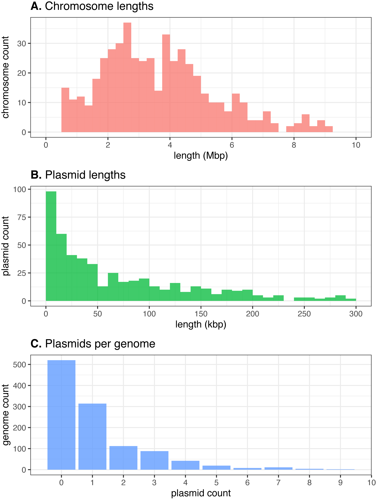
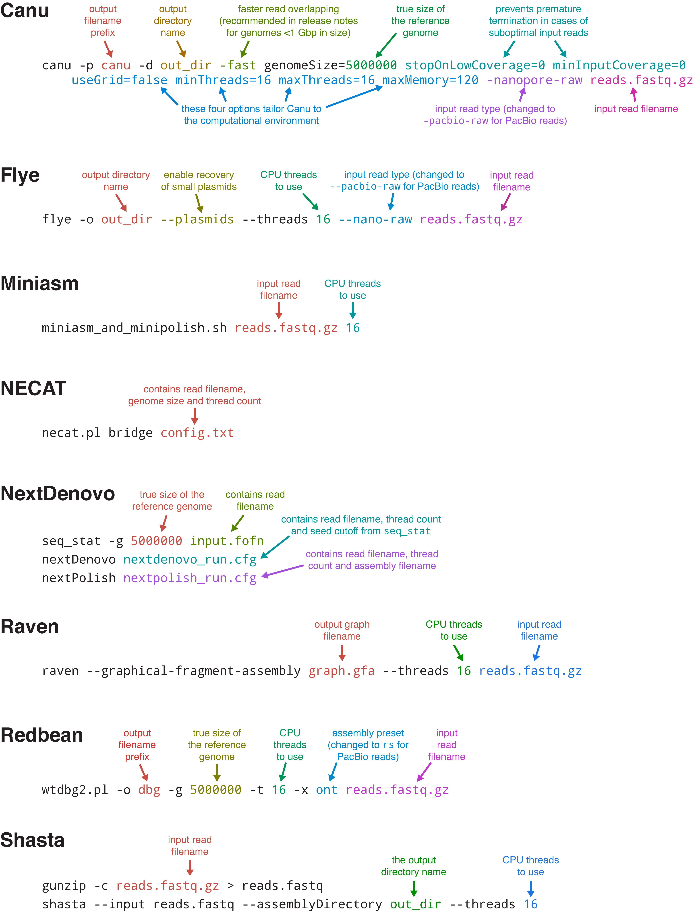
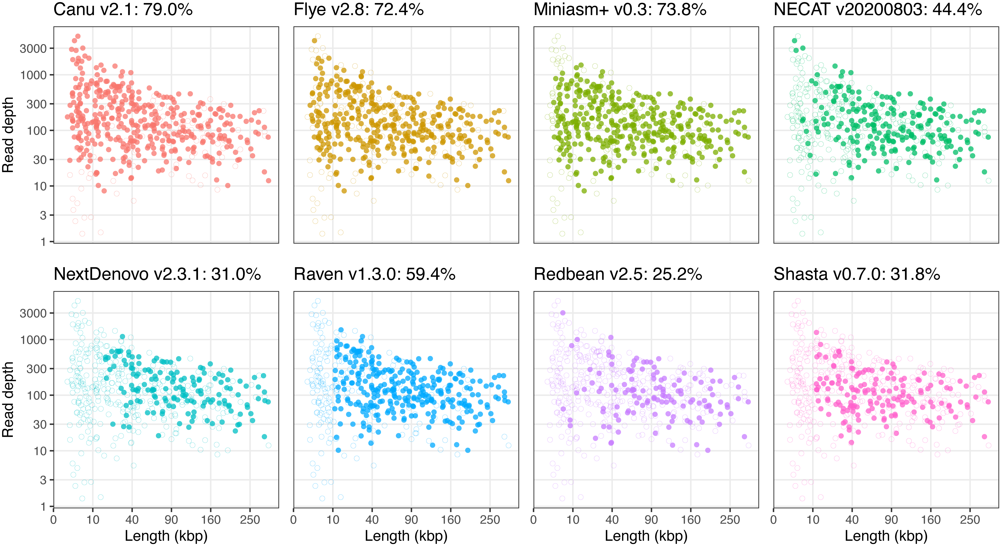
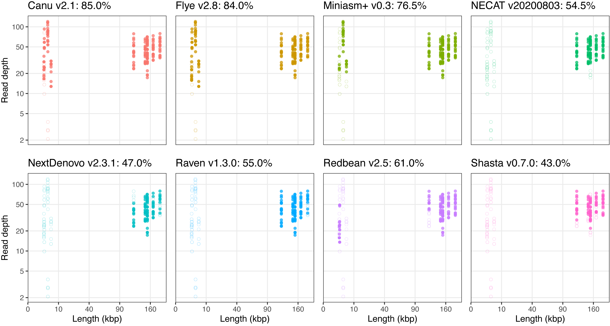

# Benchmarking of long-read assemblers for prokaryote whole genome sequencing

This repo contains the supplementary figures, scripts and data used for our paper comparing long-read assemblers: 
[Wick RR, Holt KE. Benchmarking of long-read assemblers for prokaryote whole genome sequencing. F1000Research. 2019;8(2138).](https://f1000research.com/articles/8-2138)

Are you interested in the older version of this comparison which was hosted here on GitHub? You can still find it [here](https://github.com/rrwick/Long-read-assembler-comparison/tree/96dfbe7e6edd6195cdd7fbe6f532f0022a7ebbb9).

  

## Figures

__Figure 1.__ Assembly results for the simulated read sets, which cover a wide variety of parameters for length, depth and quality. (A) Proportion of each possible assembly outcome. (B) Relative contiguity of the chromosome for each assembly, showing cleanliness of circularisation. (C) Sequence identity of each assembly's longest alignment to the chromosome. (D) Total time taken (wall time) for each assembly. (E) Maximum RAM usage for each assembly. 'Miniasm+' here refers to the entire Miniasm/Minipolish assembly pipeline.

    

__Figure 2.__ Assembly results for the real read sets, half containing ONT MinION reads (circles) and half PacBio RSII reads (X shapes). (A) Proportion of each possible assembly outcome. (B) Relative contiguity of the chromosome for each assembly, showing cleanliness of circularisation. (C) Sequence identity of each assembly's longest alignment to the chromosome. (D) Total time taken (wall time) for each assembly. (E) Maximum RAM usage for each assembly. 'Miniasm+' here refers to the entire Miniasm/Minipolish assembly pipeline.

    

## Supplementary figures

__Figure S1.__ Distributions of chromosome sizes (A), plasmid sizes (B) and per-genome plasmid counts (C) for the reference genomes used to make the simulated read sets.

    

__Figure S2.__ Badread parameter histograms for the simulated read sets. (A) Mean read depths were sampled from a uniform distribution ranging from 5x to 200x. (B) Mean read lengths were sampled from a uniform distribution ranging from 100 to 20000 bp. (C) Read length standard deviations were sampled from a uniform distribution ranging from 100 to twice that set's mean length (up to 40000 bp). (D) Mean read identities were sampled from a uniform distribution ranging from 80% to 99%. (E) Max read identities were sampled from a uniform distribution ranging from that set's mean identity plus 1% to 100%. (F) Read identity standard deviations were sampled from a uniform distribution ranging from 1% to the max identity minus the mean identity. (G, H and I) Junk, random and chimera rates were all sampled from an exponential distribution with a mean of 2%. (J) Glitch sizes/skips were sampled from a uniform distribution ranging from 0 to 100. (K) Glitch rates for each set were calculated from the size/skip according to this formula: 100000/(1.6986^(s/10)). (L) Adapter lengths were sampled from an exponential distribution with a mean of 50.

    

__Figure S3.__ Top: the target simulated depth of each replicon relative to the chromosome. The smaller the plasmid, the wider the range of possible depths. Bottom: the absolute read depth of each replicon after read simulation.

    

__Figure S4.__ Commands used for each of the six assemblers tested.

    

__Figure S5.__ Possible states for the assembly of a circular replicon. Reference sequences are shown in the inner circles in black and aligned contig sequences are shown in the outer circles in colour (red at the contig start to violet at the contig end). (A) Complete assembly with perfect circularisation. (B) Complete assembly but with missing bases leading to a gapped circularisation. (C) Complete assembly but with duplicated bases leading to overlapping circularisation. (D) Incomplete assembly due to fragmentation (multiple contigs per replicon). (E) Incomplete assembly due to missing sequence. (F) Incomplete assembly due to misassembly (non-contiguous sequence in the contig).

    

__Figure S6.__ Reference triplication for assembly assessment. (A) Due to the ambiguous starting position of a circular replicon, a completely-assembled contig will typically not align to the reference in a single unbroken alignment. (B) Doubling the reference sequence will allow for a single alignment, regardless of starting position. (C) However, if the contig contains start/end overlap (i.e.\ contiguity >100%) then even a doubled reference may not be sufficient to achieve a single alignment, depending on the starting position. (D) A tripled reference allows for an unbroken alignment, regardless of starting position, even in cases of >100% contiguity.

    

__Figure S7.__ Contiguity of the simulated read set assemblies plotted against Badread parameters for each of the tested assemblers. These plots show how well the assemblers tolerate different problems in the read sets. (A) Mean read depth (higher is better). (B) Max read identity (higher is better). (C) N50 read length (higher is better). (D) The sum of random read rate and junk read rate (lower is better). (E) Chimeric read rate (lower is better). (F) Adapter sequence length (lower is better). (G) Glitch size/skip (lower is better).

    

__Figure S8.__ Plasmid completion for the simulated read set assemblies for each of the tested assemblers, plotted with plasmid length and read depth. Solid dots indicate completely assembled plasmids (contiguity ≥99%) while open dots indicate incomplete plasmids (contiguity <99%). Percentages in the plot titles give the proportion of plasmids which were completely assembled.

    

__Figure S9.__ Plasmid completion for the real read set assemblies for each of the tested assemblers, plotted with plasmid length and read depth. Solid dots indicate completely assembled plasmids (contiguity ≥99%) while open dots indicate incomplete plasmids (contiguity <99%). Percentages in the plot titles give the proportion of plasmids which were completely assembled.

     

__Figure S10.__ The relative contiguity of the plasmids for each real read set assembly (A) and simulated read set assembly (B).

    

__Figure S11.__ The maximum indel size in the longest alignment to the chromosome for each real read set assembly (A) and simulated read set assembly (B).

    

## License

[Creative Commons Attribution 4.0 International](https://creativecommons.org/licenses/by/4.0/legalcode)

